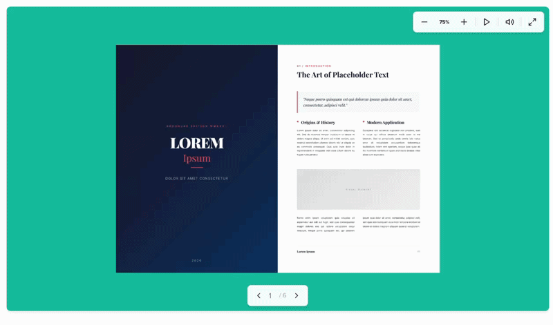

[](https://github.com/Nodlik/StPageFlip/blob/master/LICENSE) 
# StPageFlip

// Just applying some changes and fixes to the original, to make it more versatile.



Powerful, simple, and flexible JS Library for creating realistic and beautiful page turning effect.

### Features

- Works with simple images on canvas and complex HTML blocks
- Has simple API and flexible configuration
- Compatible with mobile devices
- Supports landscape and portrait screen mode
- Supports soft and hard page types (only in HTML mode)
- No dependencies

### Installation

Download bundle from Github

`npm install`

### Usage

If you've installed the package from npm, you should import PageFlip from page-flip package, or just use `<script/>` tag:

```html
<script src="{path/to/scripts}/page-flip.browser.js"></script>
```

To create a new PageFlip object:

```js
import { PageFlip } from 'page-flip';

const pageFlip = new PageFlip(htmlParentElement, settings);

// or if you're using a script tag and page-flip.browser.js:
const pageFlip = new St.PageFlip(htmlParentElement, settings);
```

`htmlParentElement - HTMLElement`- root element, where the book will be created

`settings: object` - configuration object.

To draw on a canvas, use `loadFromImages`:

```js
pageFlip.loadFromImages(['path/to/image1.jpg', 'path/to/image2.jpg' ... ]);
```

To load page from html elements - use `loadFromHtml`:

```js
pageFlip.loadFromHtml(items);
```

For example:

```html
<div id="book">
    <div class="my-page" data-density="hard">Page Cover</div>
    <div class="my-page">Page one</div>
    <div class="my-page">Page two</div>
    <div class="my-page">Page three</div>
    <div class="my-page">Page four</div>
    <div class="my-page" data-density="hard">Last page</div>
</div>
```

```js
const pageFlip = new PageFlip(document.getElementById('book'), {
    width: 400, // required parameter - base page width
    height: 600, // required parameter - base page height
});

pageFlip.loadFromHTML(document.querySelectorAll('.my-page'));
```

Use `data-density="hard"` attribute to specify page type (`soft | hard`) and define flipping animation.

### Config

To set configuration define these parameters when creating an object:

| Parameter                                        | Type                     | Required               | Default   | Description                                                                                 |
| ------------------------------------------------ | ------------------------ | ---------------------- | --------- | ------------------------------------------------------------------------------------------- |
| `width`                                          | `number`                 | Yes                    | -         | Base page width                                                                             |
| `height`                                         | `number`                 | Yes                    | -         | Base page height                                                                            |
| `size`                                           | `"fixed"` \| `"stretch"` | No                     | `"fixed"` | Whether the book will be stretched under the parent element or not                          |
| `minWidth`, `maxWidth`, `minHeight`, `maxHeight` | `number`                 | With `size: "stretch"` | -         | Threshold values to set when using stretch mode                                             |
| `drawShadow`                                     | `boolean`                | No                     | `true`    | Draw shadows or not when page flipping                                                      |
| `flippingTime`                                   | `number`                 | No                     | `1000`    | Flipping animation time (milliseconds)                                                      |
| `usePortrait`                                    | `boolean`                | No                     | `true`    | Enable switching to portrait mode (uses cloning of html elements)                           |
| `startZIndex`                                    | `number`                 | No                     | `0`       | Initial value to z-index                                                                    |
| `startPage`                                      | `number`                 | No                     | `0`       | Page number from which to start viewing                                                     |
| `autoSize`                                       | `boolean`                | No                     | `true`    | If `true`, the parent element will be equal to the size of the book                         |
| `maxShadowOpacity`                               | `number [0..1]`          | No                     | `1`       | Shadow intensity (1: max intensity, 0: hidden shadows)                                      |
| `showCover`                                      | `boolean`                | No                     | `false`   | First and last pages will be marked as hard and shown in single page mode                   |
| `mobileScrollSupport`                            | `boolean`                | No                     | `true`    | Disable content scrolling when touching a book on mobile devices                            |
| `swipeDistance`                                  | `number`                 | No                     | `30`      | Minimum distance to detect swipe (px) (new on 1.1.0)                                        |
| `clickEventForward`                              | `boolean`                | No                     | `true`    | Forward click events to page children (`a` and `button` tags) (new on 1.1.0)                |
| `useMouseEvents`                                 | `boolean`                | No                     | `true`    | Use mouse and touch events to page flipping (new on 1.2.0)                                  |
| `disableFlipByClick`                             | `boolean`                | No                     | `false`   | Lock flipping by clicking on the whole book (clicking only works in corners) (new on 2.0.3) |

### Events

To listen events use the method `on`:

```js
pageFlip.on('flip', (e) => {
    // callback code
    alert(e.data); // current page number
});
```

Available events:

| Event               | Payload                                                      | Description                                                                                                                   |
| ------------------- | ------------------------------------------------------------ | ----------------------------------------------------------------------------------------------------------------------------- |
| `flip`              | `number`                                                     | Triggered by page turning                                                                                                     |
| `changeOrientation` | `"portrait"` \| `"landscape"`                                | Triggered when page orientation changes                                                                                       |
| `changeState`       | `"user_fold"` \| `"fold_corner"` \| `"flipping"` \| `"read"` | Triggered when the state of the book changes                                                                                  |
| `init`              | `{page: number, mode: 'portrait' \| 'landscape'}`            | Triggered when the book is init and the start page is loaded. Listen (`on`) this event before using the "loadFrom..." methods |
| `update`            | `{page: number, mode: 'portrait' \| 'landscape'}`            | Triggered when the book pages are updated (using the "updateFrom..." methods)                                                 |

Event object has two fields: `data: number | string` and `object: PageFlip`

### Methods

| Method                                               | Returns                       | Description                                                                  |
| ---------------------------------------------------- | ----------------------------- | ---------------------------------------------------------------------------- |
| `getPageCount()`                                     | `number`                      | Get number of all pages                                                      |
| `getOrientation()`                                   | `'portrait'` \| `'landscape'` | Get the current orientation                                                  |
| `getBoundsRect()`                                    | `PageRect`                    | Get current book sizes and position                                          |
| `getCurrentPageIndex()`                              | `number`                      | Get the current page number (starts at 0)                                    |
| `turnToPage(pageNum: number)`                        | `void`                        | Turn to the specified page number (without animation)                        |
| `turnToNextPage()`                                   | `void`                        | Turn to the next page (without animation)                                    |
| `turnToPrevPage()`                                   | `void`                        | Turn to the previous page (without animation)                                |
| `flipNext(corner: 'top' \| 'bottom')`                | `void`                        | Turn to the next page (with animation)                                       |
| `flipPrev(corner: 'top' \| 'bottom')`                | `void`                        | Turn to the previous page (with animation)                                   |
| `flip(pageNum: number, corner: 'top' \| 'bottom')`   | `void`                        | Turn to the specified page (with animation)                                  |
| `loadFromImages(images: string[])`                   | `void`                        | Load page from images                                                        |
| `loadFromHtml(items: NodeListOf \| HTMLElement[])`   | `void`                        | Load page from html elements                                                 |
| `updateFromHtml(items: NodeListOf \| HTMLElement[])` | `void`                        | Update page from html elements (new on 0.4.0)                                |
| `updateFromImages(images: string[])`                 | `void`                        | Update page from images (new on 0.4.0)                                       |
| `destroy()`                                          | `void`                        | Destructor. Remove a root HTML element and all event handlers (new on 0.4.0) |
